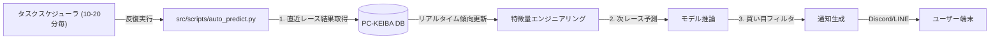

# Phase 19: 本番運用と監視計画 (Deployment & Monitoring Plan) - 改定版

## 目的 (Objective)
Keiiba-AIシステムを本番運用フェーズへ移行します。当日朝の初期化だけでなく、レース開催中は**リアルタイムに最新のレース結果（トラックバイアス等）を取り込み**、高精度の予測と推奨買い目を自動通知することをゴールとします。

**最終ゴール**: Discord または LINE への自動通知（馬券購入は手動）。

## アーキテクチャ (Architecture)

## 1. 通知プラットフォーム選定 (Platform Selection)

ユーザーの要望（◎〇記号、期待値、表形式など）を踏まえた比較です。

| 特徴 | Discord Webhook | LINE Messaging API | LINE Notify (参考) |
| :--- | :--- | :--- | :--- |
| **料金** | **無料** | フリープラン: **月200通まで無料** (それ以上は有料プラン必須) | 無料 (※2025年3月末でサービス終了予定) |
| **表現力** | **高 (Embed)** 色分け、表組み、リッチなレイアウトが可能。 ◎〇▲の整列表示が見やすい。 | **中 (Flex Message)** 自由度は高いが実装がやや複雑。 単純テキストだとズレやすい。 | 低 テキスト＋画像のみ。 |
| **実装難易度** | **低** (URLにPOSTするだけ) | 中 (Access Token管理など) | 低 |
| **推奨** | **◎ Discord** | △ (配信数制限がネック) | × (終了予定のため) |

**結論**: 情報を密（マーク、期待値、買い目）に送る場合、視認性とコスト面で **Discord** を推奨します。LINEの場合は月間通数制限（200通＝1日2場開催だとすぐ枯渇）があるため、有料プラン検討が必要です。

## 2. 実装計画 (Implementation Steps)

### A. 自動予測スクリプト (`src/scripts/auto_predict.py`)
単発実行ではなく、**ステートレスに「現在時刻」に基づいて判断**するロジックにします。

1.  **起動時処理**:
    *   当日の全レース予定を取得。
    *   **終了したレース**の結果を取得し、当日のトラックバイアス特徴量（内枠有利、逃げ有利など）を再計算。
2.  **実行対象抽出**:
    *   「発走15分前 〜 30分前」のレースをターゲットにする。
    *   既に通知済みのレースは除外（DBまたはファイルで管理）。
3.  **予測 & 通知作成**:
    *   推論実行。
    *   通知メッセージ生成（下部仕様参照）。

### B. スケジューリング (Scheduling)
*   **頻度**: 開催日の 09:30 ～ 16:30 の間、**15分おき**に実行。
*   **方法**: Windows タスクスケジューラを使用。
    *   トリガー: 毎日 9:30 から 15分間隔（継続時間 8時間）。
    *   条件: 土日のみ（または祝日含む）。

## 3. 通知コンテンツ仕様 (Notification Content)

以下のようなリッチな通知を目指します（Discord Embed例）。

**タイトル**: 🎯 東京11R [G1] 天皇賞(秋) (15:40)

**本命予測 (Top Picks)**
| 印 | 馬番 | 馬名 | 期待値 (EV) | AI勝率 |
|:--:|:--:|:---|:---:|:---:|
| ◎ | **05** | ドウデュース | **1.84** | 24% |
| 〇 | 11 | ジャスティンパレス | 1.10 | 18% |
| ▲ | 09 | ホウオウビスケッツ | 0.95 | 12% |
| △ | 01 | ベラジオオペラ | 0.80 | 8% |

**🎫 推奨買い目 (Betting Strategy)**
*   **推奨度**: 🔥 A (勝負レース)
*   **券種**: 3連単 フォーメーション (24点)
    *   1着: 05
    *   2着: 11, 09, 01, 07
    *   3着: 11, 09, 01, 07, 03, 14
*   (解説: 内枠先行馬の好走トレンド発生中。EV値 1.5超えのため勝負。)

## 4. 今後の拡張計画 (Future Roadmap)

馬券自動購入は行わず、以下の方向にシステムを拡張します。

*   **Phase 20: ダッシュボードのモバイル対応 & リモートアクセス**
    *   スマホから予測結果や当日の収支状況をグラフで見られるようにする（StreamlitのCloud化やngrok利用）。
*   **Phase 21: 定期的なモデル自動再学習 (MLOps)**
    *   毎週のレース結果を自動で学習データに取り込み、月1回モデルをアップデートするパイプラインの構築。
*   **Phase 22: レース回顧AI**
    *   レース終了後、「なぜAIが外したか」「展開がどう違ったか」を自動分析してレポートする機能。
