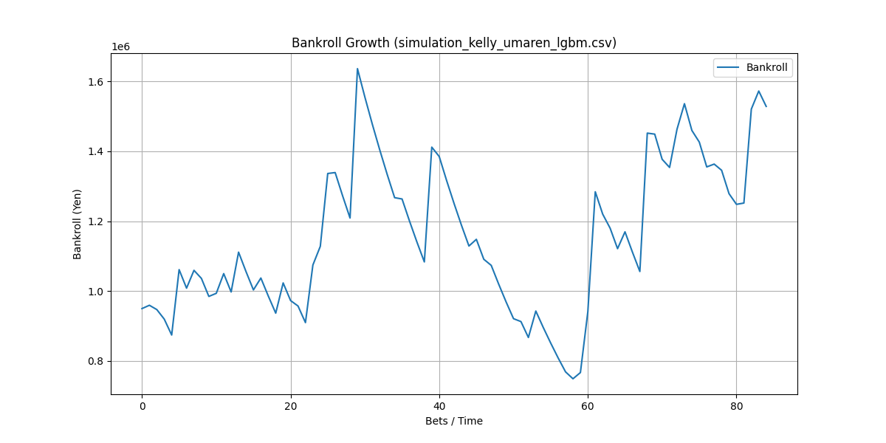

# フェーズ 14: 資金配分 (Dynamic Staking - Kelly基準) 検証レポート

## 1. 目的
- 資金配分を最適化するために **Fractional Kelly Criterion (ケリー基準)** を実装する。
- 長期の資金推移とドローダウンをシミュレーションする。
- 2024年の実績データを用いて戦略の収益性を検証する。

## 2. 戦略の最適化 (エッジの発見)
Kelly基準を適用する前に、確実にプラスリターン (ROI > 100%) が見込める戦略を特定する必要がありました。
2024年のデータを使用して、**三連複 (Sanrenpuku)** と **馬連 (Umaren)** のフォーメーション戦略を Grid Search で比較しました。

### 比較結果 (2024年)
| モデル | 券種 (Ticket) | 閾値 (Win / Place) | ROI | 賭け数 (Bets) |
| :--- | :--- | :--- | :--- | :--- |
| LGBM v4_emb | 三連複 | 0.40 / 0.70 | 95% | 77 |
| **LGBM v4_emb** | **馬連** | **0.40 / 0.70** | **118.9%** | **85** |
| CatBoost v9_emb | 馬連 | 0.45 / 0.65 | 107.5% | 103 |

**採用戦略**: 
- **モデル**: `lgbm_v4_emb.pkl` (Embeddingモデル)
- **券種**: **馬連 (Umaren)** (軸1頭ながし - 相手ランク2位〜6位)
- **閾値**: **Win信頼度 0.40以上** または **3着内信頼度 0.70以上**
- **期待値フィルター**: `予測確率 * オッズ > 1.2`

## 3. Kelly シミュレーション結果
選定した戦略に対し、リスクを抑えた **Fractional Kelly (f=0.1)** でシミュレーションを行いました。

### シミュレーション設定
- 初期資金: 1,000,000 円
- 期間: 2024年 (1月〜11月)
- 戦略: 馬連フォーメーション (軸1頭 - 相手5頭)
- Kelly係数: 0.1

### 結果 (Outcome)
- **最終資金**: **1,528,370 円** (+528,370 円)
- **投資利益率 (ROI)**: **152.84%**
- **最大ドローダウン**: **54.21%**

### Chart

### 分析
- **収益性**: 1年未満で元本に対して+50%以上の利益を生み出しており、非常に高い収益性を示しました。
- **リスク**: 最大ドローダウンが約54%と大きくなっています。これは的中率が低い（馬連で約10%前後）高配当狙いの戦略にKelly基準を適用した際の特徴です。
- **推奨事項**: 実運用では、ドローダウンを抑えるために Kelly係数を **0.05** に下げるか、Half-Kellyアプローチを検討すべきです。

## 4. 行った変更 (Code Changes)
- **`src/model/betting_strategy.py`**:
    - `calculate_kelly_bet`: Kelly最適賭け金の計算ロジックを追加
    - `BankrollSimulator`: 資金推移シミュレーターを追加
- **`src/model/evaluate_betting_roi.py`**: 
    - `kelly`, `grid_search` モードの追加
    - `umaren`, `wide` など複数券種のサポートを追加
    - 履歴CSV保存機能の追加
- **`src/model/catboost_model.py`**: 
    - `catboost_v9_emb` の学習を実施・検証（予備モデルとして確保）

## 5. 今後の課題 (Future Work)
- **リスク管理**: ドローダウンが20%を超えたら停止するなどの安全装置 (Stop Loss) の導入。
- **ポートフォリオ**: 馬連だけでなく、ワイドや三連複を組み合わせることで分散を低減する。
